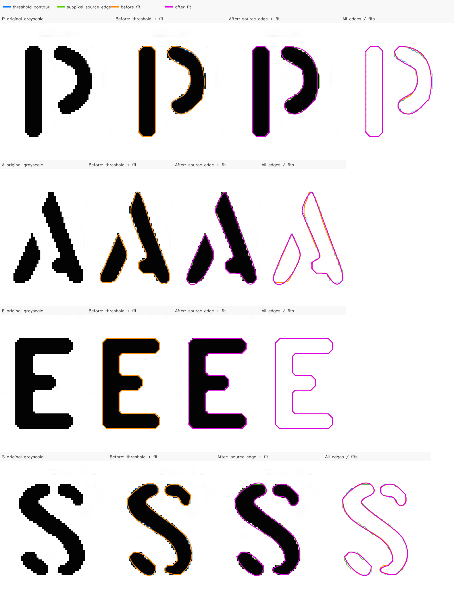

# Coleman subpixel source-edge diagnostic

This diagnostic uses the exact 1,170 × 444 Coleman source with SHA-256
`e72143e3b6ef3bd7ae2ff03bf49c90130317a194b69620a69b493667b1acc786`,
displayed at 80.0 × 30.358974 mm, manual threshold 122, no smoothing, and the
0.10 mm user-facing native fitting tolerance. The source pitch is
0.0683760684 mm per pixel.

The blue line is the existing threshold contour, green is the accepted
subpixel source-edge position, orange is the restored pre-`4039047` fit, and
magenta is the fit after source-edge localization. The grayscale panels use
nearest-neighbor enlargement only for inspection; they do not supply fitting
geometry.

## Critical P-bowl comparison

The critical outer P bowl is the same 147-sample cubic span diagnosed before
`4039047`.

| Measurement | Maximum (mm) | RMS (mm) | Signed mean (mm) |
|---|---:|---:|---:|
| 1. Restored cubic → threshold contour | 0.066449 | 0.033027 | -0.005640 |
| 2. Threshold contour → source crossing | 0.011856 | 0.006583 | +0.005994 outward |
| Restored cubic → source crossing | 0.068650 | 0.034286 | -0.011571 |
| 3. Refitted cubic → source crossing | 0.064342 | 0.035779 | -0.004843 |

The source-edge displacement is only about 20% of the threshold-fit RMS, so it
does not confirm source contour localization as the dominant total-error term.
It is, however, comparable to the old signed centering bias. Refitting against
the recovered edge reduces the systematic inward source-relative bias by 58%
and reduces maximum source-relative error by 6.3%. The full P bowl changes from
15 to 14 native segments; the critical outer span remains one cubic.

## A, E, and S controls

These values compare each complete cropped glyph's fitted path against the
accepted source-edge samples. Segment totals include every independent stencil
component in the crop.

| Glyph | Source displacement RMS / max (mm) | Segments before → after | Source-edge RMS before → after (mm) | Source-edge max before → after (mm) |
|---|---:|---:|---:|---:|
| A | 0.006628 / 0.012407 | 23 → 19 | 0.022554 → 0.020840 | 0.073212 → 0.059191 |
| E | 0.002856 / 0.011856 | 72 → 72 | 0.002304 → 0.002304 | 0.013377 → 0.013377 |
| S | 0.006768 / 0.012821 | 32 → 31 | 0.025475 → 0.022589 | 0.072049 → 0.065321 |

The E is unchanged because its classified straight runs and hard-corner support
are protected. A and S improve without added segments. Nested contours are not
refined, and ambiguous thin-edge profiles are rejected rather than assigned a
crossing.

As a real-source large-letter control, the complete Coleman `o` crop changes
from 48 to 47 segments while aggregate source-edge maximum/RMS error changes
from 0.081235/0.025569 mm to 0.079563/0.022141 mm. An independent supersampled
analytic D-bowl control also reduces known-geometry maximum/RMS error and does
not add segments.

This is automated/offline source analysis, not a physical-accuracy claim.
